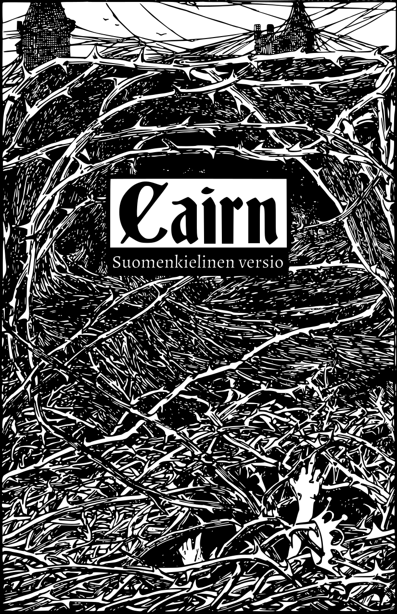

Cairn on [seikkailupeli](http://questingblog.com/adventure-game-vs-osr), jossa tutkitaan pimeää ja salaperäistä Metsää, joka on täynnä outoa väkeä, kätkettyjä aarteita ja sanoin kuvaamattomia hirvityksiä. Hahmojen luominen on nopeaa ja sattumanvaraista, hahmoilla ei ole luokkia ja peli perustuu kerronnalliseen etenemiseen pikemminkin kuin kokemuspisteisiin tai tasomekaniikkoihin. Se perustuu Ben Miltonin [Knaveen](https://www.drivethrurpg.com/product/250888/Knave) ja Chris McDowallin [Into The Oddiin](https://chrismcdee.itch.io/electric-bastionland). Pelin on kirjoittanut [Yochai Gal](https://newschoolrevolution.com). Pelin suomenkielisen käännöksen on tehnyt [Kari Silvennoinen](https://kalifi.org).

Pelin koko teksti on lisensoitu [CC-BY-SA 4.0](https://creativecommons.org/licenses/by-sa/4.0/) -käyttöluvalla.

[{:height="50%" width="50%"}](img/cairn.svg)
